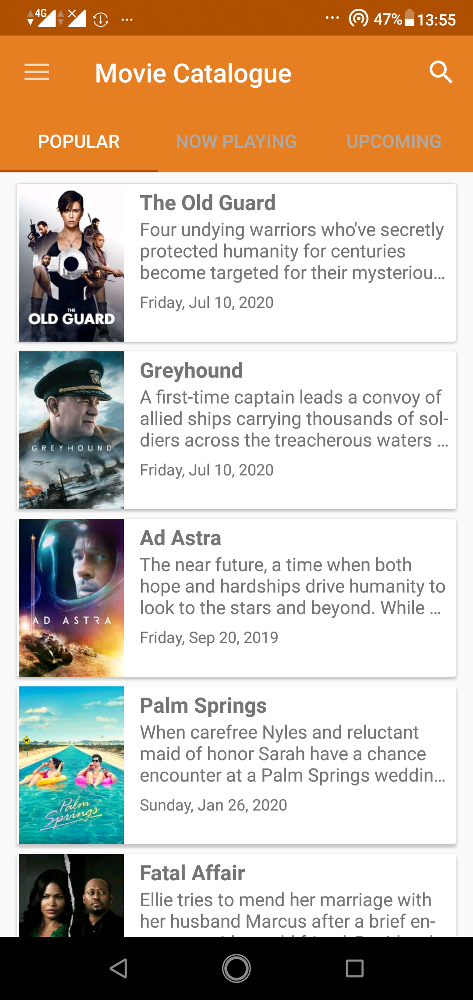
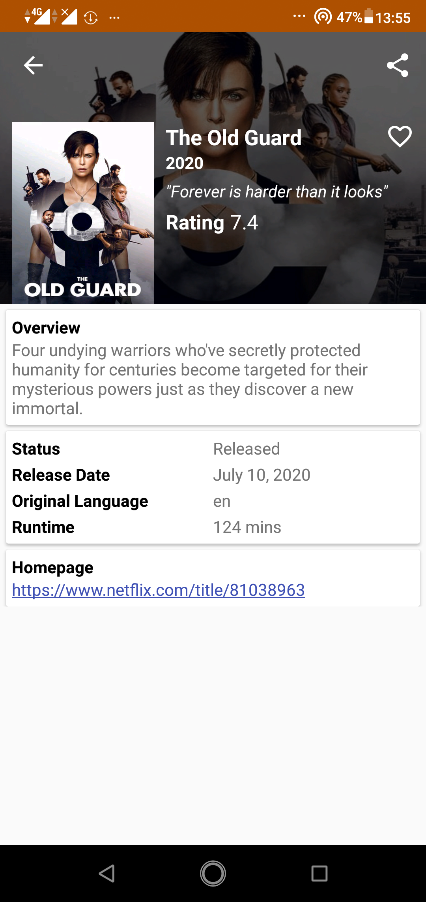
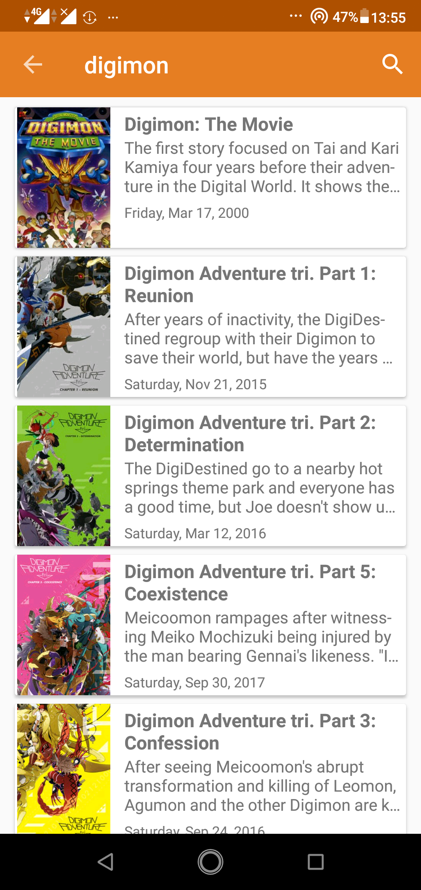
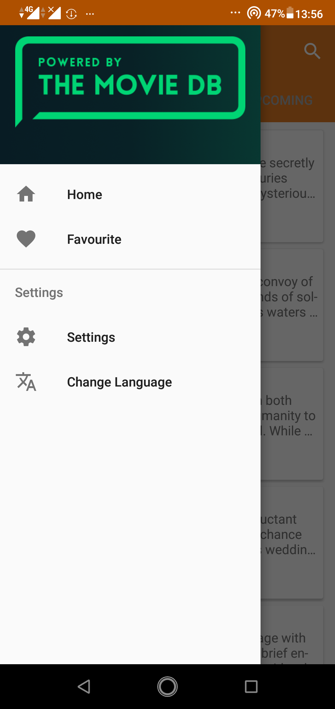
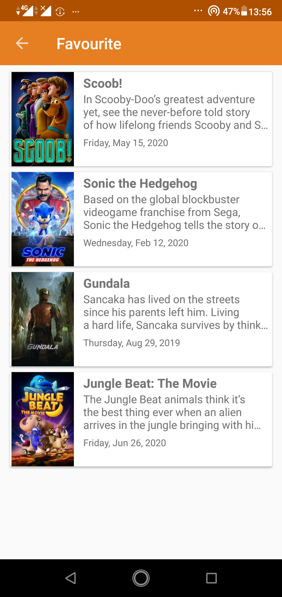
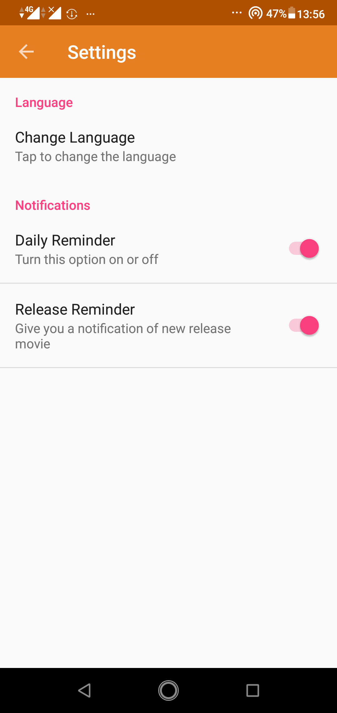
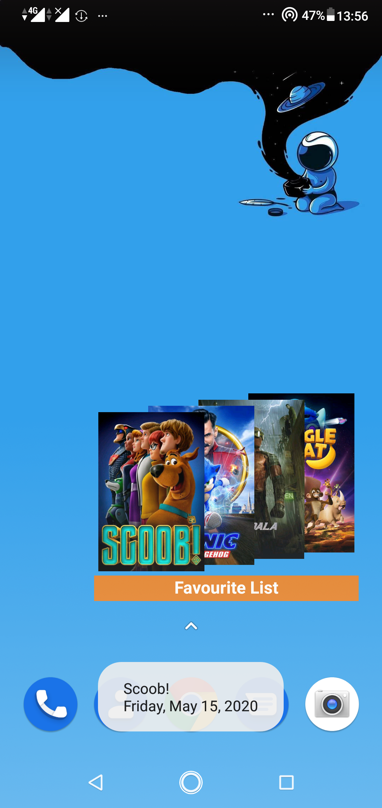

<h1 align="center">
Movie Catalogue
</h1>
This is my submission progress at Dicoding online course at class Belajar Fundamental Aplikasi Android (BFAA). I've enrolled in this class as part of Faculty Development Program from Dicoding (2018).

## Screenshots

  
  
  
  
  
  
  

## Features

1. Popular movies 
2. Upcoming movies
3. Now Playing movies
4. Search movies
5. Localitation (Inggris dan Indonesia)
6. Popular, upcoming, now playing base on the region from language.
7. Save favourite movie into SQLite database.
8. Module to show favourite movie.
9. Stack Widget to show favourite movie poster.
10. Notification daily reminder.
12. Keep data when orientation changed

API from : <a href="https://www.themoviedb.org/" title="TheMovieDB">TheMovieDB</a>

## Tech Stack
- [x] Java
- [x] SQLite
- [x] Retrofit
